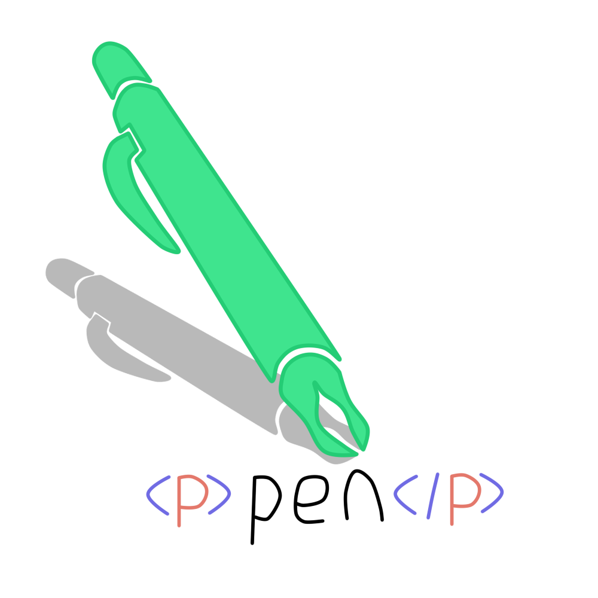

# Pen

[](https://travis-ci.org/Monochromefx/pen-coffee)
[](https://github.com/Monochromefx/pen)
[](https://github.com/Monochromefx/pen)

Pen is a rather big API but not too big but only big enough for some *ink*.

Pen is an api used to manipulate elements and or create.

It is inspired by [jQuery.js](https://jquery.com/) and follows something similar to [umbrella.js](https://umbrellajs.com/)
And umbrella follows off inspiration of jquery but jquery is a **big** library.

Umbrella is small yes but it follows an **array return**.
Which is rather complicated to debug as well as manipulate if you don't know what you're doing.
```js
u('<p>') // Returns an array in which you HAVE to do this u('<p>')[0]
u('div.with.fifty.elements') // returns an array as well but you have to cycle through each element.
// Just to get to the specific element that you want or need.
```


Which Umbrella does not have loop protection which can cause some bugs.
```html
<p></p>
<span></span>
```
```js
for (var i = 0; i < 15; i++) {
  u('p').append(u('<span>').html("some span"))
  u('span').append(u('<p>').html('some p'))
  // append does not support multiple parameters passed.
}
// this will call a loop
/* Reason why this calls a loop to occur is because no element was assigned a specific class or id or attribute
And so what will happen is that umbrella will interpret each p in the whole document
as well as each span in the whole document and each p and span will also have a p and span inside of those elements
And this will go on for a very long time. More than what is expected.*/
```

Pen was made to make it more similar to Umbrella but does not follow an array.
It's very easy to just manipulate only 1 element per call.
```js
pen('p') // returns the class but all you have to do is this: pen('p').el or pen('p').element
```
It also supports passing objects and arrays:
```js
var div = document.createElement('div')
var arr = []
for (var i = 0; i < 10; i++) {
  arr[i] = document.createElement('p')
}
pen(arr).html("woohoo I'm copied!").id("same")
pen(div).html("some new text").append([...arr])
```
Which will append all the elements inside the array to it's parent. Resulting in this:
```html
<div>
  <p id='same'>woohoo I'm copied</p>
  <p id='same'>woohoo I'm copied</p>
  <p id='same'>woohoo I'm copied</p>
  <!-- And so on -->
</div>
```
But has the same power almost as Umbrella though it does not support AJAX.

It will in the very near future.

# Documentation and examples
[Docs](docs)
[Examples](examples)

# Contribution

Use git if you have it and clone this repository
```batch
git clone https://github.com/Monochromefx/pen.git
```
Adjust fixes if needed to add features you think need to be in it.
Then make a pull request.
