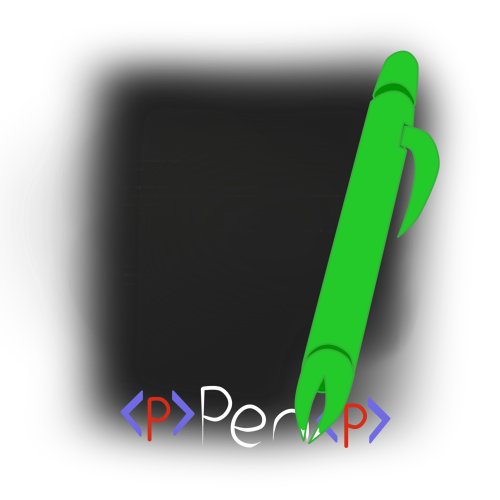

# Pen

Pen is a rather big API but not too big but only big enough for some *ink*,
is an api used to manipulate elements and or create.

It is inspired by [jQuery.js](https://jquery.com/) and follows something similar to [umbrella.js](https://umbrellajs.com/).

The object may look something like this:
```js
//I'll be using a p element for this example
pen: {
  attrs: {id: 'moose'},
  // events was moved inside the el object, because, its easier to manage
  text: (...),
  el: 'p#moose',
  cel: (...),
  tag: 'p',
  Children:['a'],
  PARENT: null
}
```

---

[Docs](docs) -- for documentation
[Examples](examples) -- for examples on how to create things for yourself or how pen can be used

..:Test:..

[selector](tests/selector/)

There's a selector app that allows you to interact with the webpage itself.

---

## Contribution

Use git if you have it and clone this repository
```batch
git clone https://github.com/James-Chub-Fox/pen.git
```
Adjust fixes if needed to add features you think need to be in it.
Then make a pull request.

## Note about using pen("&lt;p id='someID'&gt;")

When creating an element via: **pen("&lt;p id='someID'&gt;");**

It's much slower than: **pen("&lt;p&gt;").attr('id', 'someID');**

---

## Raw, Production Development links
[Raw](https://raw.githubusercontent.com/Chubby-Roo/pen/master/Pen.js)

[production](https://cdn.rawgit.com/Chubby-Roo/pen/master/Pen.js)

[development](https://rawgit.com/Chubby-Roo/pen/master/Pen.js)
